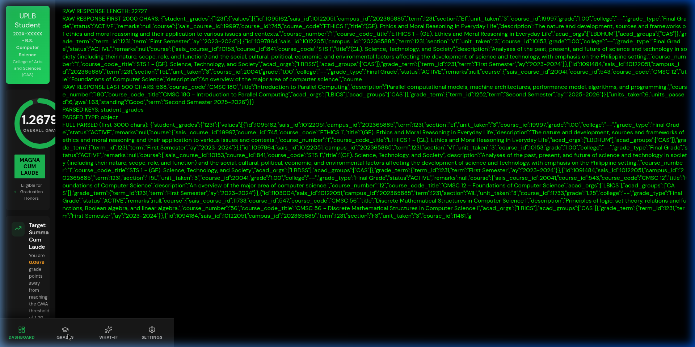

# 🎓 UPLB AMIS Grade Calculator & Latin Honors Predictor

A modern, responsive, and premium web application built for **University of the Philippines Los Baños (UPLB)** students. It securely synchronizes academic records from the AMIS Portal to calculate General Weighted Average (GWA), track curriculum progress, and predict Latin Honors eligibility in real-time.

Designed with **Green Deck** aesthetics (dark-first, Spotify-inspired interfaces), featuring high-contrast layout grids, glassmorphism panel styling, interactive GWA gauges, and custom-tailored what-if grade simulators.

---

## 📸 Screenshot



---

## ✨ Features

- **⚡ Direct AMIS Connection**: Paste your secure Bearer token (extracted from the browser) to instantly download records from the AMIS API.
- **🛡️ Local-First & Private**: Your academic details, tokens, and session details are processed entirely in the browser and stored locally via `localStorage`. No data is uploaded to external servers.
- **📊 Interactive GWA Gauge**: Visualize your standing against university thresholds with a radial gauge and honor level indicators.
- **🏆 Latin Honors Eligibility**: Computes standing using official UPLB academic rules and checks eligibility against criteria rules (accounting for failed grades `5.00`, incompletes `INC`, or dropped courses `DRP`).
- **🎯 What-If Simulator**: Predict the grades you need in remaining courses to graduate with honors, featuring real-time GWA forecasting.
- **📝 Course Exclusions**: Toggle the contribution of individual courses (such as PE/HK, NSTP, and non-academic electives) to see how they impact your overall average.

---

## 🔒 How to Connect Your AMIS Data

Since the official AMIS API resides behind secure campus endpoints, the application provides two methods to connect your data:

### Method A: Bearer Token (Recommended)
You can get your Bearer token in two ways:

#### Option 1: One-click Console Script (Easiest)
1. Log in to your [AMIS Portal](https://amis.uplb.edu.ph/) in another browser tab.
2. Open your browser's Developer Tools (`F12` or `Ctrl + Shift + I` / `Cmd + Option + I`) and click the **Console** tab.
3. Paste the following script and press **Enter** to instantly copy your token to your clipboard:
   ```javascript
   let t="";Object.keys(localStorage).concat(Object.keys(sessionStorage)).forEach(k=>{const v=localStorage.getItem(k)||sessionStorage.getItem(k);if(v&&v.includes("|"))t=v});if(t){copy(t);console.log("Token copied!")}
   ```
4. Paste the copied token into the **Bearer Token** input field in this app, then click **Fetch and Connect**.

#### Option 2: DevTools Network Tab
1. Log in to your [AMIS Portal](https://amis.uplb.edu.ph/).
2. Open DevTools (`F12`) and select the **Network** tab.
3. Reload the page, click on any `api-amis.uplb.edu.ph` request, and go to the **Headers** pane.
4. Copy the value of the `Authorization` header starting with `Bearer ...`.
5. Paste it into the **Bearer Token** input field in this app, then click **Fetch and Connect**.

### Method B: Manual JSON Upload
If the direct fetch fails or your token has expired, you can download your grades as a file:
1. Log in to [amis.uplb.edu.ph](https://amis.uplb.edu.ph/).
2. Open your browser's Developer Tools (`F12`) and click the **Console** tab.
3. Paste this script and press **Enter**:
   ```javascript
   fetch("https://api-amis.uplb.edu.ph/api/students/grades?summarize=true", {
     credentials: "include"
   })
   .then(r => r.text()).then(t => { const b = new Blob([t], { type: "application/json" });
   const a = document.createElement("a"); a.href = URL.createObjectURL(b);
   a.download = "amis-grades.json"; a.click(); });
   ```
4. Come back here, switch to the **Upload JSON File** tab, and choose the downloaded `amis-grades.json` file.

---

## 📐 Academic Calculation Rules

Calculations follow the official guidelines set by the **University of the Philippines Los Baños**:

### 1. Latin Honors Thresholds
*   **Summa Cum Laude**: GWA $\le$ `1.2000`
*   **Magna Cum Laude**: GWA $\le$ `1.4500`
*   **Cum Laude**: GWA $\le$ `1.7500`

### 2. Disqualifying Marks
The honors calculator checks course history and flags warnings if any of the following marks are detected:
*   A grade of **`5.00`** (Fail)
*   Unremoved **`INC`** (Incomplete)
*   **`DRP`** (Dropped)

### 3. Automatically Excluded Courses
By default, non-academic courses are excluded from the GWA computation to prevent skewing GWA standings:
*   Physical Education courses (`PE 1`, `PE 2`, `HK 11`, `HK 12`, `HK 13`, etc.)
*   National Service Training Program (`NSTP 1`, `NSTP 2`)
*   Excluded courses can be toggled manually back into GWA at any time in the **Grades** view.

---

## 🛠️ Tech Stack & Architecture

- **Frontend**: React 18, Vite, Lucide Icons
- **Fonts**: DM Sans (headings, interfaces) & JetBrains Mono (monospaced credentials & JSON readouts)
- **Local Cache**: LocalStorage for student records and profile custom settings
- **Server proxying**: Vite dev server proxies request targets from `/api-proxy` to `api-amis.uplb.edu.ph` to bypass CORS security policies.

---

## 🚀 Getting Started

To run the application locally:

### 1. Prerequisites
- [Node.js](https://nodejs.org/) (v18 or higher recommended)
- `npm` or `yarn`

### 2. Installation
```bash
# Clone the repository
git clone https://github.com/your-username/uplb-grade-calculator.git
cd uplb-grade-calculator

# Install dependencies
npm install
```

### 3. Run Development Server
```bash
npm run dev
```
Open [http://localhost:5173/](http://localhost:5173/) in your web browser.

### 4. Build for Production
```bash
npm run build
```
The compiled files will be located in the `dist/` directory.

---

## 🛡️ License

Distributed under the MIT License. See `LICENSE` for more information.
